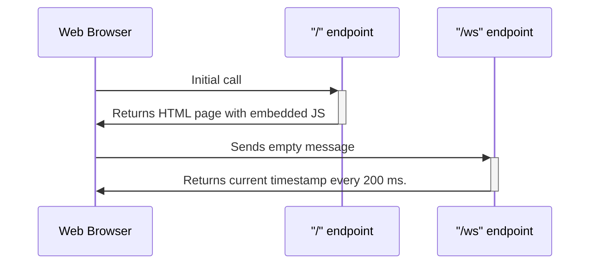

# WebSocket Demo

The project illustrates a use case of the [websocket](https://www.rfc-editor.org/rfc/rfc6455) (ws) protocol.

## Modus Operandi

- The client app sends empty request to the server.
- Upon successful handshake, the server pushes current UTC timestamp formated as the ISO string. It's done perpetually with the delay of 200 ms. between two consecutive responses.
- Client app tails and displays 20 most recent responses.



## How to run

### Prerequisites

- [Docker](https://www.docker.com/)
- [gnuMake](https://www.gnu.org/software/make/)

### Commands

- Run to see available commands:

```commandline
make help
```

- Run to start the server:

```commandline
make start
```

- Run to stop the server and clean the environment:

```commandline
make stop
```
